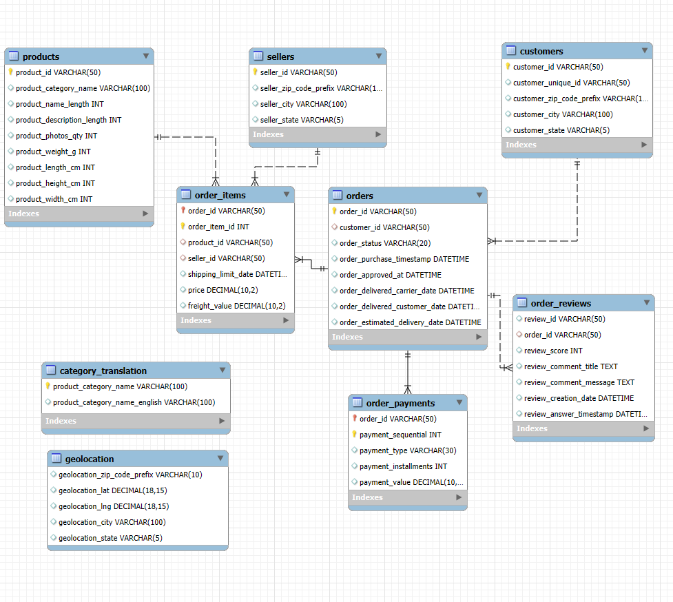
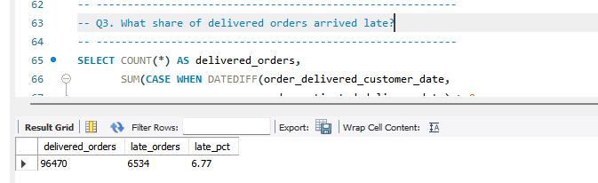
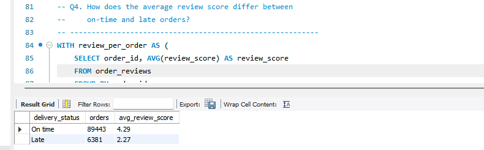
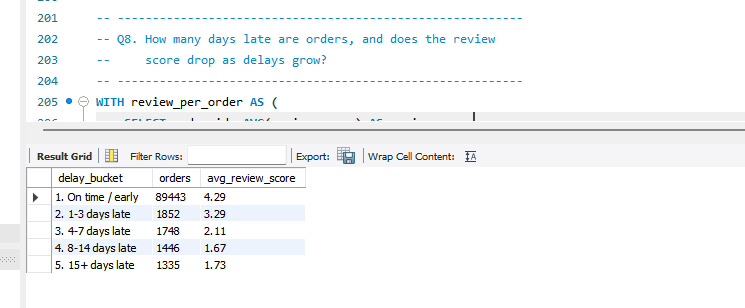

# Olist E-Commerce: Delivery Performance & Customer Satisfaction (SQL)

I analysed about two years of Brazilian e-commerce orders in MySQL to answer one question: **how much do late deliveries hurt customer reviews, and where does the lateness come from?**

The short answer: only about 1 in 15 orders arrives late, but those orders score **2.27 stars on average, compared with 4.29 for on-time orders**.

---

## Business Problem

Olist connects small sellers with customers across Brazil. If an order shows up after the date promised at checkout, the customer is likely to be unhappy, and that shows up in the review. I wanted to measure how big that effect is and find out which states, sellers and product categories are involved, so a team could decide where to focus.

## Dataset

- **Source:** [Olist Brazilian E-Commerce Public Dataset](https://www.kaggle.com/datasets/olistbr/brazilian-ecommerce) on Kaggle
- **Size:** 9 tables, about 99,000 orders placed between **Sep 2016 and Oct 2018**
- **Tables:** customers, sellers, products, category_translation, orders, order_items, order_payments, order_reviews, geolocation

The CSV files are not included in this repo because of their size. Download them from Kaggle (link above).

## Tools

MySQL 8.0 and MySQL Workbench. Skills used: multi-table joins, CTEs, window functions (`RANK`, `LAG`), `CASE` logic, date functions, aggregation, and data cleaning during import.

---

## Database Structure



`orders` sits at the centre. Customers, items, payments and reviews all link to it, and items link out to products and sellers.

Two tables are intentionally left unlinked:
- `category_translation`: some products have no translated category, so a foreign key would reject valid rows.
- `geolocation`: zip code prefixes repeat many times, so they can't act as a key.

---

## Key Findings

1. **Late deliveries are the minority, but costly.** Of 96,470 delivered orders, 6,534 (**6.77%**) arrived after the estimated date.
2. **Reviews drop sharply when orders are late.** On-time orders average **4.29** stars, late orders **2.27**.
3. **Even a small delay hurts.** The score falls to 3.29 for orders 1 to 3 days late, 2.11 for 4 to 7 days, and levels off around 1.7 after a week.
4. **Lateness is concentrated in the northeast.** Alagoas has the highest late rate at **21.4%**, about three times the national 6.8%, followed by Maranhao (17.4%) and Sergipe (15.2%).
5. **Big sellers are not always the late ones.** Among the ten sellers with the most late orders (all in Sao Paulo), late rates range from about 5% to 10.5%. Some high-volume sellers sit below the 6.8% average, so volume alone doesn't explain lateness.
6. **Revenue grew quickly through 2017, then flattened.** Monthly revenue peaked at about R$988K in Nov 2017 and stayed between roughly R$825K and R$980K through 2018.
7. **Revenue is spread across many categories.** health_beauty, watches_gifts and bed_bath_table lead, and the top 10 categories make up about 62% of revenue.

### Selected results

**Share of delivered orders that arrived late (Q3)**



**Review score, on-time vs late (Q4)**



**Review score by number of days late (Q8)**



---

## Data Quality Notes

Before any analysis I checked the data and made these decisions (see `02_data_quality.sql`):

- About **97%** of orders have the status `delivered`. Delivery questions use delivered orders only, since the others have no delivery date.
- **8** delivered orders have no delivery date, so I excluded them.
- **547** orders have more than one review. I averaged the score per order before joining, otherwise those orders would be counted twice.
- An order counts as **late** when it arrived on a later calendar day than estimated (`DATEDIFF > 0`). The estimated date has no time of day, so comparing raw timestamps would wrongly flag same-day deliveries.
- Some products have an empty category name. They appear as `unknown`.

## Business Questions Answered

| # | Question | Techniques |
|---|----------|------------|
| Q1 | Monthly revenue and order trend | Date functions, GROUP BY |
| Q2 | Top product categories by revenue | Joins, window function for revenue share |
| Q3 | Share of delivered orders that arrived late | CASE WHEN |
| Q4 | Review score for on-time vs late orders | CTE, joins, AVG |
| Q5 | States with the highest late-delivery rate | CTE, filtering on aggregates |
| Q6 | Sellers with the most late deliveries | COUNT DISTINCT, HAVING |
| Q7 | Categories with the lowest review scores | Multiple CTEs |
| Q8 | Does review score drop as delays grow? | Bucketing with CASE |
| Q9 | Top 10 customers by spend | CTE, RANK() |
| Q10 | Month-over-month revenue growth | LAG() |

Each query in `03_analysis.sql` has its question above it and my written insight below it.

---

## Repository Structure

```
olist-delivery-analysis-sql/
├── 01_setup.sql          # create database, tables, load data, foreign keys
├── 02_data_quality.sql   # data checks
├── 03_analysis.sql       # business questions Q1 to Q10 with insights
├── images/               # ER diagram and result screenshots
└── README.md
```

## How to Run It

1. Install MySQL 8.0 or higher (CTEs and window functions need it).
2. Download the dataset from Kaggle and extract the 9 CSV files.
3. Find the folder MySQL allows for imports: `SHOW VARIABLES LIKE 'secure_file_priv';`
4. Copy the CSVs into that folder, and update the file paths in `01_setup.sql` if yours differ. Use forward slashes in the paths.
5. Run `01_setup.sql`, then `02_data_quality.sql`, then `03_analysis.sql`.

---

## Limitations and What I'd Do Next

- This shows that late orders have lower reviews. It doesn't prove lateness alone causes the low score, since damaged items or wrong products could also be involved in some cases.
- Review scores are only available for customers who chose to leave one.
- Next I'd look at freight cost and seller-to-customer distance (using the geolocation table) to see whether long routes explain the northeastern delays, and build a Power BI dashboard on top of these queries.

---

## About Me

**Shubham Adate**, Data Analyst based in Mumbai.
[LinkedIn](https://www.linkedin.com/in/adate-shubham) | [GitHub](https://github.com/shubhamadatework-git)
